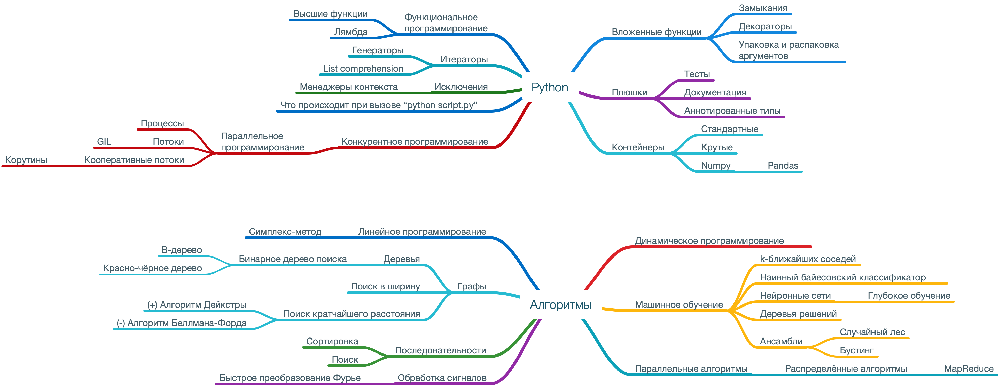

# Python. Bar Review

Набор заметок о синтаксисе языка Python.
Каждая заметка — отдельный [Jupyter notebook](https://jupyter.org).
Для интерактивного просмотра нужен Jupyter.

Чтобы установить все зависимости, выполните из корня репозитория
следующий код. 

```shell
pipenv install
```

Остаётся запустить Jupyter.
```shell
pipenv run jupyter notebook
```

**NB** Содержимое ноутбуков можно смотреть прямо на GitHub.

## Содержание

1. [Вложенные функции, замыкания и декораторы](01-nested_functions-closures-decorators.ipynb)
2. [Итераторы, генераторы и функциональное программирование](02-iterators-generators-functional_programming.ipynb)
3. [Контейнеры — WIP](03-containers.ipynb)

## Идеи для занятий (файл может меняться)

