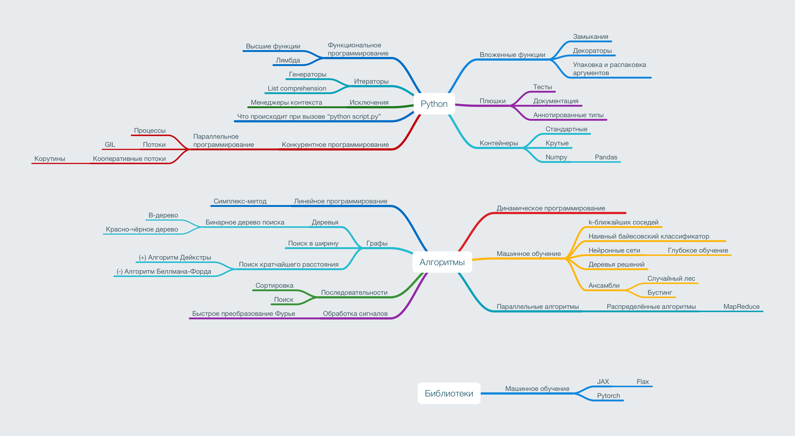

# Python. Bar Review


Набор заметок о синтаксисе языка Python.
Каждая заметка — отдельный [Jupyter notebook](https://jupyter.org).
Для интерактивного просмотра нужен Jupyter.

Чтобы установить все зависимости, сначала выполните из корня репозитория
команду

```shell
pipenv install
```

затем запустите Jupyter Lab.

```shell
pipenv run jupyter lab
```

Альтернативный вариант — использовать [docker](https://www.docker.com).
Для этого из подкаталога *docker* надо вызвать следующую команду.

```shell
docker-compose up
```

**NB!** Содержимое ноутбуков можно смотреть прямо на GitHub.

## Содержание

1. [Вложенные функции, замыкания и декораторы](01-nested_functions-closures-decorators.ipynb)
2. [Итераторы, генераторы и функциональное программирование](02-iterators-generators-functional_programming.ipynb)
3. [Контейнеры 1](03-containers-1.ipynb)
4. [Контейнеры 2](04-containers-2.ipynb)

В работе:

- [ ] [Конкурентное программирование — WIP](05-concurrency.ipynb)
- [ ] [Алгоритмы. Числа — WIP](xx-algorithms-numbers.ipynb)
- [ ] [Алгоритмы. ML — WIP](xx-algorithms-machine_learning.ipynb)

## Идеи для занятий (файл может меняться)



Новые идеи присылайте через [GitHub Issues](https://github.com/ckorikov/python-bar-review/issues)
